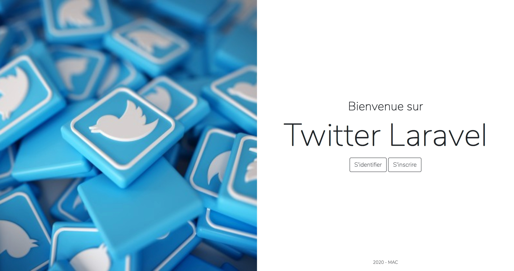
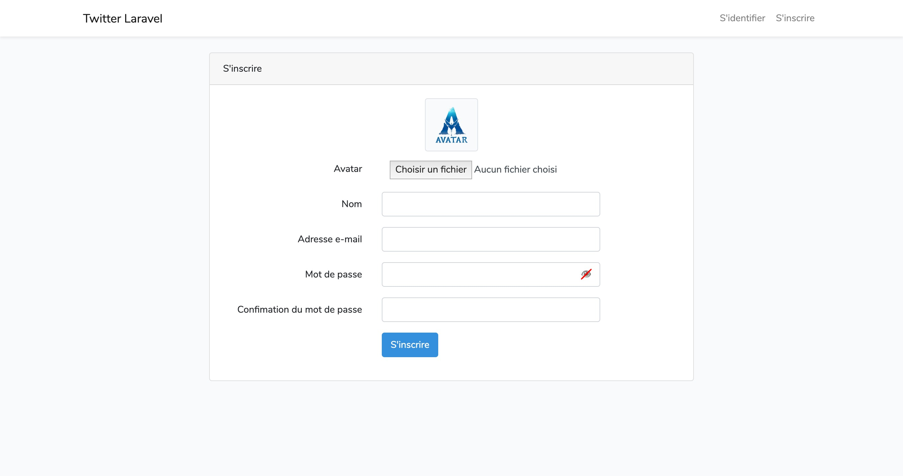
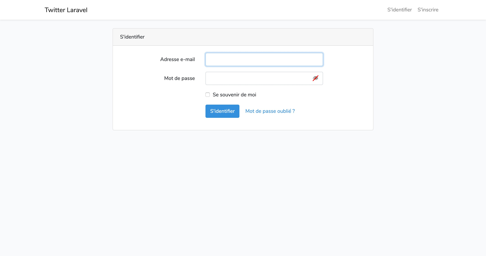
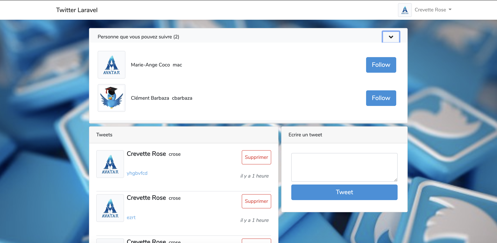
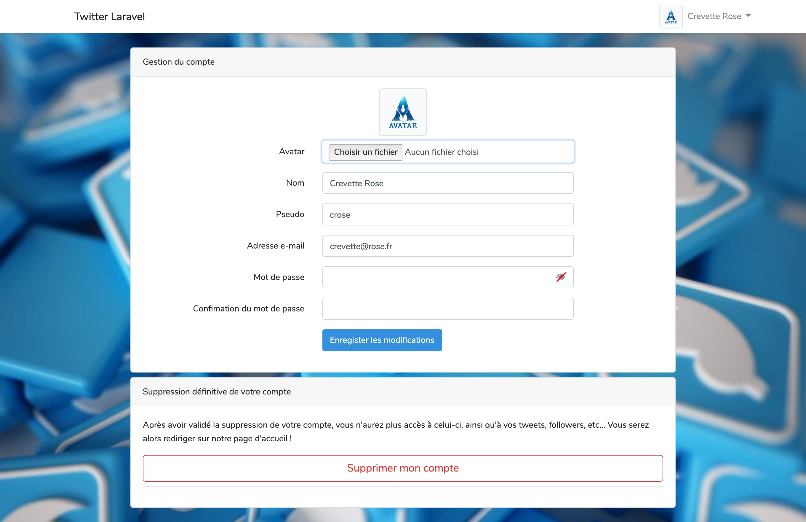
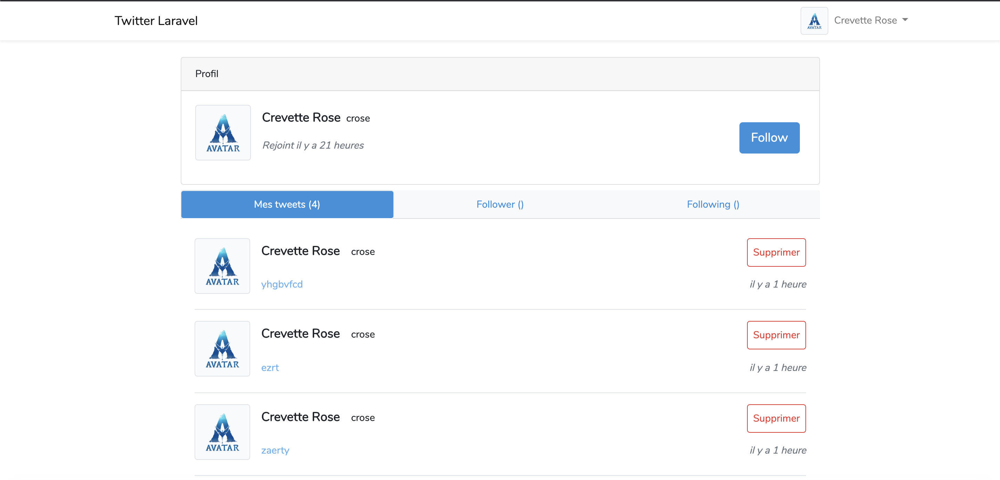
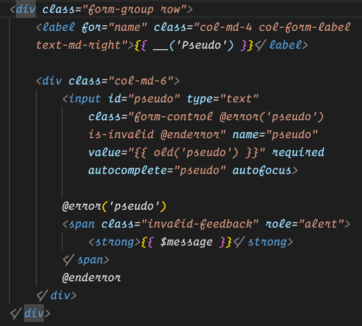

# Twitter Laravel

Application de page unique de type Twitter avec Laravel, avec une chronologie se mettant à jour automatiquement, la possibilité de follow/unfollow des utilisateurs et une authentification basique avec Avatar ou non.

## I - Guide utilisateur

### A. Page de bienvenue

-   Modification de la page d'accueil basique de Laravel par une page d'accueil avec un design épuré correspondant à notre application.

    -   Bienvenue sur Twitter Laravel
    -   Un bouton d'inscription (S'inscrire)
    -   Un bouton d'identification (S'identifier)



### B. Authentification

-   Modification du système d'authentification de Laravel (inscription, connexion) pour utiliser un nom (name) et un nom d'utilisateur ou pseudo (pseudo) avec ou sans avatar (avatar). Un avatar par défault sera utilisé à la création du compte utilisateur et le pseudo ainsi que l'adresse e-mail est unique.

    -   Ex: Avatar - John Do - @johnDo.
        

        

### C. Page d'accueil

A la création du compte ou à l'identification, nous arrivons sur la page d'accueil de l'application.

-   Un menu de navigation est accessible sur toutes les pages une fois la connexion effectuée avec quelques options :
    -   Le titre de l'application 'Twitter Laravel' ramenant sur la page de bienvenue.
    -   Votre nom ou pseudo permettant d'accéder à un sous-menu déroulant comportant les actions suivantes :
        1. Un bouton de "Se déconnecter" redirigeant l'utilisateur sur la page de bienvenue, en le déconnectant.
        2. Un bouton "Profil" de redirection vers la page de profil utilisateur.
        3. Un bouton "Compte" de redirection vers la gestion de votre compte.

Nous pouvons y voir les personnes déjà inscrites et les suivre ou non au besoin.

Nous pouvons également poster des tweets, les visualiser et les supprimer.



### D. Page Compte

La page de gestion du compte est disponible dans le menu de navigation comme expliquer précédemment dans la page d'accueil.

-   Vous y trouverez vos informations de compte avec possibilité de modifier à votre guise, votre avatar, nom, pseudo (tant qu'il reste unique), adresse e-mail, mot de passe.
    -   Lors d'une modification un message vous averti de la prise en compte de l'action.
-   Vous pourrez également si vous le souhaitez, supprimer complétement votre compte grâce à la rubrique de "Suppresion définitive de compte" situé en dessous de la gestion du compte.
    **_`Attention cette action est irréversible !`_**
    -   Une fois l'action effectué, vous êtes alors redirigé sur la page de bienvenue de l'application, avec un message vous confirmant la suppression de votre compte.



### E. Page Profil

La page de profil est disponible dans le menu de navigation comme expliqué précédemment dans la page d'accueil.
Sur celle-ci vous trouverez vos informations de profil :

1. Vos tweets,
2. Follower = ceux qui me suive
3. Following = ceux que moi je suis

En cliquant sur le nom d'un utilisateur, vous avez la possibilité de voir son profil.



## II - Guide Technique

Dans ce projet nous avons utilisés le CDN Bootstrap pour gérer le style de nos pages, ainsi que du jquery/javascript utilisé pour certains affichages.
Pour nos fichiers de vue coder en PHP, nous utilisons "Blade" natif dans les projets LARAVEL.

-   Définitiion de Blade :
    Blade est le moteur de modélisation simple mais puissant fourni avec Laravel. Contrairement à d'autres moteurs de modèles PHP populaires, Blade ne vous empêche pas d'utiliser du code PHP simple dans vos vues. En fait, toutes les vues Blade sont compilées en code PHP brut et mises en cache jusqu'à ce qu'elles soient modifiées, ce qui signifie que Blade n'ajoute pratiquement pas de surcharge à votre application. Les fichiers de vue de lame utilisent l' extension de fichier et sont généralement stockés dans le répertoire '''..blade.phpresources/views'''

### A. Création du projet

Pour créer un projet avec des messages d'erreur en français, cela est possible en ajoutant le dossier "fr" dans le répertoire "ressources/lang/".

-   Il faut ensuite modifier le fichier "app.php" situé "app/config" en modifiant les lignes suivantes par "fr" au lieu de "en" :

```

    'locale' => 'fr',
    'fallback_locale' => 'fr',
    'faker_locale' => 'fr_FR',
```

#### 1 - En invite de commande

1. Création du projet avec ou sans authentification (--auth)
    ```
    laravel new nom_du_projet --auth
    ```
2. Intégration complète de Bootstrap au projet sans lien CDN
    - Installation du composant Bootstrap
        ```
        composer require laravel/ui --dev
        ```
    - Intégration du composants dans le projet
        ```
        php artisan ui bootstrap --auth
        ```
    - Mise à jour des fichiers crée avec l'intégration des class de Bootstrap
        ```
        npm install && npm run dev
        ```

Le projet doit maintenant être crée avec Bootstrap intégrer !!
Vérifier l'intégration de Bootstrap en lançant le serveur :

```
php artisan serve
```

Le terminal vous renvoie l'url et le port sur lequel se lance votre projet
ex par défault: **http://127.0.0.1:8000**

#### 2 - Intégration Base de Données

-   Créer une BDD vide dans phpMyAdmin (MAMP ou autres).
    Lui donner le nom du projet exemple "laravel-twitter"

-   Modifier le ".env" du projet en conséquences

    1. Faire correspondre les données suivantes entre MySQL et votre projet

    ```
    DB_CONNECTION=mysql
    DB_HOST=localhost;
    DB_PORT=8889
    DB_DATABASE=laravel-twitter
    DB_USERNAME=root
    DB_PASSWORD=root
    ```

    2. Modifier la ligne suivante pour les utilisateurs de mamps
       `DB_HOST=localhost;unix_socket=/Applications/MAMP/tmp/mysql/mysql.sock`

Votre projet dois désormais être connecter à la base de données, vous pourrez le constatez une fois que vous aurez effectué des migrations dans votre projet.
Ou bien en créant des utilisateurs en lançant le serveur car sur ce projet l'authentification de base de laravel est installé avec le projet et donc fonctionnel :
`php artisan serve`

Si dans votre BDD, vous pouvez voir les utilisateurs crée, c'est que la connexion est correctement effectué.

**_`Attention à chaque modification du fichier ".env", il faut relancer le serveur !`_**

### B. Modification du système d'authentification (user) de base de LARAVEL

#### 1. Modification de la migration

La migration se situe dans le dossier "database" puis "migrations"

-   Nom de la migration : année_mois_jour_000000_create_users_table.php
-   État par défault :

```
    <?php

    use Illuminate\Database\Migrations\Migration;
    use Illuminate\Database\Schema\Blueprint;
    use Illuminate\Support\Facades\Schema;

    class CreateUsersTable extends Migration
    {
    \*\*
    _ Run the migrations.
    _
    _ @return void
    _/
    public function up()
    {
    Schema::create('users', function (Blueprint $table) {
                $table->bigIncrements('id');
    $table->string('name');
                $table->string('email')->unique();
    $table->timestamp('email_verified_at')->nullable();
                $table->string('password');
    $table->rememberToken();
                $table->timestamps();
    });
    }

        /**
        * Reverse the migrations.
        *
        * @return void
        */
        public function down()
        {
            Schema::dropIfExists('users');
        }

    }
```

-   Ajout des données à la migration
    Le Schema de la function up() correspond aux attributs de la table "Users" de la BDD.
    Il suffit donc de lui ajouter nos nouveaux attribut, ici nous avons besoin d'un avatar, ainsi qu'un pseudonyme pour l'utlisateur.

    -   L'avatar peut être nulle car non obligatoire à la création d'un compte

    ```
       $table->string('avatar')->nullable();
    ```

    -   Le pseudonyme lui doit être unique car il ne peut exister 2 utilisateurs avec le même pseudonyme sous peine de conflit.

    ```
       $table->string('pseudo')->unique();
    ```

    Pour que nos modifications prennent effet en BDD, il faut lancer la migration.

#### 2. Migration de la table des "Users"

-   Lancer la migration dans la BDD

    ```
    php artisan migrate
    ```

    Si dans votre BDD, les attributs "avatar" et "pseudo" ont été ajouté cela signifie que votre BDD est bien configuré avec votre projet.
    Sinon un message d'erreur serait apparu.

#### 3. Modification du Controller des "Users" ici "RegisterController"

-   Dans la méthode create : Ajout de la ligne 'avatar' et 'pseudo'

```

     return User::create([
            'avatar' => $path,
            'name' => $data['name'],
            'pseudo' => $data['pseudo'],
            'email' => $data['email'],
            'password' => Hash::make($data['password']),
        ]);

```

-   Dans la fonction validator : Ajout de la ligne 'pseudo'

```

return Validator::make(\$data, [
'name' => ['required', 'string', 'max:255'],
'pseudo' => ['required', 'string', 'alpha_num', 'unique:users'],
'email' => ['required', 'string', 'email', 'max:255', 'unique:users'],
'password' => ['required', 'string', 'min:8', 'confirmed'],
]);

```

#### 4. Modification du Modèle "Users.php"

-   Modification de la variable \$fillable avec 'avatar'+'pseudo' :

```

protected \$fillable = [
'avatar','name','pseudo', 'email', 'password',
];

```

#### 5. Modification de la vue (views/auth) "register.blade.php"

-   Ajout dans le formulaire existant pour l'avatar et le pseudo :

1. d'un label : ex("avatar");
2. d'un champs de saisie (input) de type text pour le pseudo et de type file pour l'avatar;

<details>
<summary>Voir le code</summary>

```
<!-- Ajout de l'avatar -->

                        <div class="form-group row">
                            <label for="avatar" class="col-md-4 col-form-label text-md-right">{{ __('Avatar') }}</label>

                            <div class="col-md-6">
                                <input type="file" id="avatar"
                                    class="form-control @error('avatar') is-invalid @enderror" name="avatar"
                                    accept="image/png, image/jpeg" value="{{ old('avatar') }}" autocomplete="avatar"
                                    autofocus onclick="changeImage();" value="">

                                @error('nom')
                                <span class="invalid-feedback" role="alert">
                                    <strong>{{ $message }}</strong>
                                </span>
                                @enderror
                            </div>
                        </div>
                        <!-- Fin ajout de l'avatar -->

```

</details>

3. Même chose pour le pseudo !

    <details>
    <summary>Voir le code</summary>

    

</details>

Un utilisateur peut désormais être crée avec un avatar et un pseudonyme !

#### 6. Avatar non obligatoire à la création du compte

-   Dans le controller "RegisterController", ajouter ceci à la fonction create :

```

    $request = app('request');
        $path = null;

        if($request->hasFile('avatar')){
            $avatar = $request->file('avatar');
            $filename = time() . '.' . $avatar->getClientOriginalExtension();
            $path = '/uploads/avatars/' . $filename;
            Image::make($avatar)->resize(100, 100)->save(public_path($path));
        }

```

-   Dans le modèle "User.php", créer une fonction pour récuperer l'avatar

```

public function getAvatar() {
if (!$this->avatar) {
             return '/img/avatar.png';
         }
         return $this->avatar;
}

```

Désormais votre création d'utilisateur doit être fonctionnel avec les nouveaux paramètres !

### C. Ajout de la possibilité de modifier le compte Utilisateur du système d'authentification (user) de base de LARAVEL

C'est-à-dire de pouvoir modifier son compte après la création (avatar, name, pseudo, mail, password, etc..)

1. Création de la vue

-   Dans un premier temps, il faut crée un vue qui accueillera le formulaire de modification disponible par l'utilisateur.

    Ce modèle de vue est une extension du modèle de vue de base de LARAVEL (style visuel). Nous rappelons donc dans nos fichiers de vue le template permettant de récupérer le même stlye sur chaque page. Cela évite également la répétition du code en ce qui concerne le HTML, le HEAD, le BODY et le MAIN grace au balisage suivantes :

    -   Appel du template avec HTML, HEAD, BODY : `@extends('layouts.app')`

    -   Appel du conteneur MAIN : `@section('content')`

    *   Cette balise est bien sûre à fermer en fin de page par ``@endsection`tout comme pour annoncer la fermeture du MAIN.

    Pour cela, crée un fichier appelé "account.blade.php" dans le dossier "/views" et y appelé les balises nécéssaire.

<details>

<summary>Cliquez ici pour voir l'exemple </summary>

```

@extends('layouts.app')

<title>Twitter Laravel</title>
@section('content')
<div class="container">
    <div class="row justify-content-center">
        <div class="col-md-10">
            @if(session()->has('ok'))
            <div class="alert alert-success alert-dismissible">{!! session('ok') !!}</div>
            @endif
            <div class="card mb-2">
                <div class="card-header">Gestion du compte</div>
                <div class="card-body">
                    <form method="POST" action="{{ route('account.update', $user->id) }}" enctype="multipart/form-data">
                        @csrf
                        <!-- Changement d'état de l'avatar de base à l'upload -->
                        <div class="mx-auto mb-2" style="width:80px; height:80px;">getAvatar()}}" width="100%"
                                height="100%">
                        </div>
                        <!-- Ajout de l'avatar -->
                        <div class="form-group row">
                            <label for="avatar" class="col-md-4 col-form-label text-md-right">{{ __('Avatar') }}</label>

                            <div class="col-md-6">
                                <input type="file" id="avatar"
                                    class="form-control @error('avatar') is-invalid @enderror" name="avatar"
                                    accept="image/png, image/jpeg" value="{{ old('avatar') }}" autocomplete="avatar"
                                    autofocus onclick="changeImage();" value="">

                                @error('nom')
                                <span class="invalid-feedback" role="alert">
                                    <strong>{{ $message }}</strong>
                                </span>
                                @enderror
                            </div>
                        </div>
                        <!-- Fin ajout de l'avatar -->

                        <div class="form-group row">
                            <label for="name" class="col-md-4 col-form-label text-md-right">{{ __('Nom') }}</label>

                            <div class="col-md-6">
                                <input id="name" type="text" class="form-control @error('name') is-invalid @enderror"
                                    name="name" value="{{Auth::user()->name}}" required autocomplete="name" autofocus>

                                @error('nom')
                                <span class="invalid-feedback" role="alert">
                                    <strong>{{ $message }}</strong>
                                </span>
                                @enderror
                            </div>
                        </div>

                        <div class="form-group row">
                            <label for="pseudo" class="col-md-4 col-form-label text-md-right">{{ __('Pseudo') }}</label>

                            <div class="col-md-6">
                                <input id="pseudo" type="text"
                                    class="form-control @error('pseudo') is-invalid @enderror" name="pseudo"
                                    value="{{Auth::user()->pseudo}}" required autocomplete="pseudo" autofocus>

                                @error('pseudo')
                                <span class="invalid-feedback" role="alert">
                                    <strong>{{ $message }}</strong>
                                </span>
                                @enderror
                            </div>
                        </div>

                        <div class="form-group row">
                            <label for="email"
                                class="col-md-4 col-form-label text-md-right">{{ __('Adresse e-mail') }}</label>

                            <div class="col-md-6">
                                <input id="email" type="email" class="form-control @error('email') is-invalid @enderror"
                                    name="email" value="{{Auth::user()->email}}" required autocomplete="email">

                                @error('email')
                                <span class="invalid-feedback" role="alert">
                                    <strong>{{ $message }}</strong>
                                </span>
                                @enderror
                            </div>
                        </div>

                        <div class="form-group row">
                            <label for="password"
                                class="col-md-4 col-form-label text-md-right">{{ __('Mot de passe') }}</label>

                            <div class="col-md-6">
                                <input id="password" type="password"
                                    class="form-control @error('password') is-invalid @enderror" name="password"
                                    autocomplete="new-password">
                                <!-- Bouton masquer/afficher mot de passe -->
                                <button class="theMask" type="button" onclick="unmask()"
                                    title="Mask/Unmask password to check content">&#128065;</button>
                                <div id="traitDiag"></div>
                                @error('password')
                                <span class="invalid-feedback" role="alert">
                                    <strong>{{ $message }}</strong>
                                </span>
                                @enderror
                            </div>
                        </div>

                        <div class="form-group row">
                            <label for="password-confirm"
                                class="col-md-4 col-form-label text-md-right">{{ __('Confimation du mot de passe') }}</label>

                            <div class="col-md-6">
                                <input id="password-confirm" type="password" class="form-control"
                                    name="password_confirmation" autocomplete="new-password">
                            </div>
                        </div>

                        <div class="form-group row mb-0">
                            <div class="col-md-6 offset-md-4">
                                <button type="submit" class="btn btn-primary">
                                    {{ __("Enregister les modifications") }}
                                </button>
                            </div>
                        </div>
                    </form>
                </div>
            </div>

            <div class="card">
                <div class="card-header">Suppression définitive de votre compte</div>
                <div class="card-body">
                    <form action="{{ route('account.destroy', $user->id) }}" method="DELETE">
                        @csrf
                        <!-- method('DELETE') -->
                        <div class="border-bottom mb-2 pb-2">

                            <p>Après avoir validé la suppression de votre compte, vous n'aurez plus accès à celui-ci,
                                ainsi qu'à vos tweets, followers, etc... <span>Vous serez alors rediriger sur notre page
                                    d'accueil !</span></p>
                            <button type="submit" class="btn btn-outline-danger p-2 btn-lg btn-block" onclick="if(confirm('Voulez-vous vraiment supprimer votre compte ?')){
                                            return true;}else{ return false;}">Supprimer mon
                                compte</button>

                        </div>

                </div>
                </form>
            </div>
        </div>
    </div>

</div>

@endsection

```

</details>

<details>

  <summary> Code JQUERY lié </summary>

-   Ajout de code JQUERY pour permettre l'affichage dynamique de la vision du mot de passe

```

<script>
    function unmask() {
        var inputType = document.getElementById('password');
        var x = document.getElementById("traitDiag");
        if (inputType.type === "password") {
            document.getElementById('password').type = "text";
            x.style.display = "none";

        } else {
            document.getElementById('password').type = "password";
            x.style.display = "block";
        }
    }
</script>
<script src="https://ajax.googleapis.com/ajax/libs/jquery/3.2.1/jquery.min.js"></script>

```

</details>

<details>

  <summary> Code du style lié </summary>

-   Intégration du style spécifique au champs mot de passe

```

<style>
    .theMask {
        border: none;
        position: absolute;
        right: 1.5px;
        top: 50%;
        transform: translate(-50%, -50%);
        filter: grayscale(80%);
    }

    #traitDiag {
        right: 25px;
        top: 45%;
        border: 1px solid red;
        width: 22px;
        position: absolute;
        border-radius: 22%;
        transform: rotate(-45deg);
        display: block;
    }

    #avatar {
        border: none;
    }
</style>

```

</details>

2. Création du controller & Gestion de la vue dans le Controller
   Pour créer le controller, il faut taper la commande suivante :

```

php artisan make:controller AccountController

```

--> A suivre ...

3. Création de la route (permet l'accès à l'url)
   --> A suivre ...
       <hr>

### Intégration de Seeders (fausse données)

#### - En invite de commande

-   Création d'un seeder de fausse données pour les tweets (post)

```

php artisan make:seed PostsTableSeeder

```

Le fichier en question "PostsTableSeeder.php" se crée dans le dossier "database/seeds" avec la composition suivantes :

```

<?php

use Illuminate\Database\Seeder;

class PostsTableSeeder extends Seeder
{
    /**
     * Run the database seeds.
     *
     * @return void
     */
    public function run()
    {
        //
    }
}
```

-   Modifier le seeder pour y ajouter les fausses données qui nous intéresse :

    1. Ajouter la méthode Faker dans les "use" (import)

    ```
    //Add use Faker
    use Faker\Factory as Faker;
    ```

    2. Ajouter l'appel du modèle de gestion des posts "Post.php"

    ```
    use App\Post;
    ```

    3. Dans la fonction run, y ajouter les attributs avec les fausses données

    ```
      //Permet de générer des fausses données 'fr_FR' en français
         $faker = Faker::create('fr_FR');

         //Boucle de création des faux posts
         for ($i = 0; $i < 10; $i++) {
             $post = new Post();
             $post->text = $faker->text();
             $post->user_id = $faker->numberBetween(1, 9);
             $post->save();
         }
    ```

-   Une fois ce fichier créer et modifier correctement, il faut l'appeler dans le fichier "DatabaseSeeder.php"

    ```
    $this->call(PostsTableSeeder::class);
    ```

-   Lancer la création des fausses données :

    ```
    php artisan db:seed
    ```

Vous pouvez vérifier que vos données ont été crée dans votre BDD !

<hr>
<p align="center"></p>

<p align="center">
<a href="https://travis-ci.org/laravel/framework"></a>
<a href="https://packagist.org/packages/laravel/framework"></a>
<a href="https://packagist.org/packages/laravel/framework"></a>
<a href="https://packagist.org/packages/laravel/framework"></a>
</p>

## À propos de Laravel

Laravel est un framework d'application web avec une syntaxe expressive et élégante. Nous croyons que le développement doit être une expérience agréable et créative pour être vraiment épanouissant. Laravel simplifie le développement en facilitant les tâches courantes utilisées dans de nombreux projets Web, tels que :

-   [Moteur de routage simple et rapide](https://laravel.com/docs/routing).
-   [Conteneur d'injection de dépendance puissant](https://laravel.com/docs/container).
-   Plusieurs back-ends pour le stockage des [session](https://laravel.com/docs/session) et du [cache](https://laravel.com/docs/cache) storage.
-   [Base de données ORM](https://laravel.com/docs/eloquent), Expressive, intuitive.
-   [Migrations de schéma indépendantes de la base de données](https://laravel.com/docs/migrations).
-   [Traitement robuste des tâches en arrière-plan](https://laravel.com/docs/queues).
-   [Diffusion d'événements en temps réel](https://laravel.com/docs/broadcasting).

Laravel est accessible, puissant et fournit les outils requis pour les grandes applications robustes

```

```
